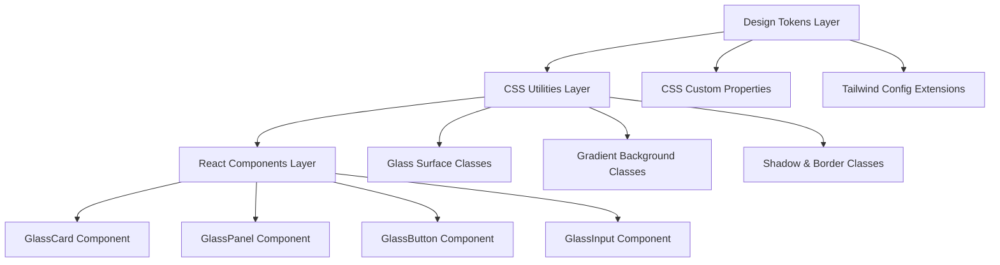
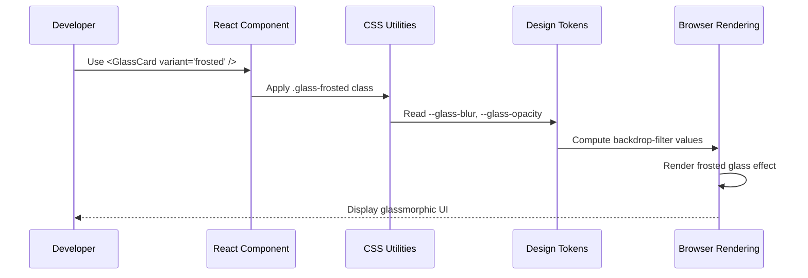

# Design Document: Glassmorphism UI Design System

## Overview

This design system implements a modern glassmorphism aesthetic for the Finsight AI application, featuring frosted glass card effects with backdrop blur, soft shadows, subtle borders, vibrant gradient backgrounds, and layered depth. The system ensures high readability through high-contrast text, smooth rounded corners, and a minimalistic layout approach. Built on top of the existing Tailwind CSS configuration, it extends the current design tokens with glassmorphism-specific utilities while maintaining consistency with the existing green/emerald color palette.

The design system provides reusable CSS classes, React component patterns, and design tokens that can be applied across all pages and components in the Next.js application. It leverages CSS backdrop-filter for frosted glass effects, CSS custom properties for theming, and Tailwind's utility-first approach for rapid development.

## Architecture

The glassmorphism design system is structured in three layers:



### Layer 1: Design Tokens

CSS custom properties define glassmorphism-specific values (blur intensity, opacity levels, border colors) that adapt to light/dark modes. These tokens are added to the existing `:root` and `.dark` selectors in `globals.css`.

### Layer 2: CSS Utilities

Tailwind utility classes and custom CSS classes provide reusable glass surface styles, gradient backgrounds, and shadow effects. These classes compose the design tokens into ready-to-use patterns.

### Layer 3: React Components

Reusable React components encapsulate glassmorphism patterns with TypeScript props for customization. Components use the CSS utilities internally and expose a clean API for developers.

## Main Algorithm/Workflow



## Components and Interfaces

### Component 1: GlassCard

**Purpose**: Primary container component for glassmorphic card surfaces with frosted glass effect, soft shadows, and subtle borders.

**Interface**:
```typescript
interface GlassCardProps {
  variant?: 'frosted' | 'subtle' | 'intense'
  gradient?: boolean
  children: React.ReactNode
  className?: string
  onClick?: () => void
}
```

**Responsibilities**:
- Apply backdrop-filter blur effect based on variant
- Render semi-transparent background with appropriate opacity
- Add soft shadows and subtle borders
- Support gradient overlay option
- Merge custom className with base styles

**Variants**:
- `frosted` (default): Medium blur (12px), 60% opacity
- `subtle`: Light blur (8px), 40% opacity
- `intense`: Heavy blur (20px), 80% opacity

### Component 2: GlassPanel

**Purpose**: Full-width or full-height panel component for larger glassmorphic sections like sidebars, modals, or page sections.

**Interface**:
```typescript
interface GlassPanelProps {
  position?: 'left' | 'right' | 'top' | 'bottom' | 'center'
  blur?: 'light' | 'medium' | 'heavy'
  children: React.ReactNode
  className?: string
  overlay?: boolean
}
```

**Responsibilities**:
- Position panel according to layout requirements
- Apply appropriate blur intensity
- Render optional dark overlay behind panel
- Handle responsive behavior
- Support fixed or absolute positioning

### Component 3: GlassButton

**Purpose**: Interactive button component with glassmorphic styling, hover effects, and accessibility support.

**Interface**:
```typescript
interface GlassButtonProps {
  variant?: 'primary' | 'secondary' | 'ghost'
  size?: 'sm' | 'md' | 'lg'
  children: React.ReactNode
  className?: string
  disabled?: boolean
  onClick?: () => void
  type?: 'button' | 'submit' | 'reset'
}
```

**Responsibilities**:
- Apply glassmorphic styling with hover state transitions
- Increase blur and brightness on hover
- Support disabled state with reduced opacity
- Maintain accessibility (focus states, ARIA attributes)
- Provide size variants

### Component 4: GlassInput

**Purpose**: Form input component with glassmorphic styling, focus states, and validation support.

**Interface**:
```typescript
interface GlassInputProps {
  type?: 'text' | 'email' | 'password' | 'number'
  placeholder?: string
  value?: string
  onChange?: (e: React.ChangeEvent<HTMLInputElement>) => void
  error?: boolean
  disabled?: boolean
  className?: string
}
```

**Responsibilities**:
- Apply glassmorphic styling to input field
- Enhance blur and border on focus
- Display error state with red border
- Support disabled state
- Maintain form accessibility

## Data Models

### Design Token Model

```typescript
interface GlassmorphismTokens {
  blur: {
    light: string    // '8px'
    medium: string   // '12px'
    heavy: string    // '20px'
    intense: string  // '32px'
  }
  opacity: {
    subtle: number   // 0.4
    frosted: number  // 0.6
    intense: number  // 0.8
  }
  border: {
    color: string    // 'rgba(255, 255, 255, 0.18)'
    width: string    // '1px'
  }
  shadow: {
    soft: string     // '0 8px 32px rgba(0, 0, 0, 0.1)'
    medium: string   // '0 12px 48px rgba(0, 0, 0, 0.15)'
    strong: string   // '0 16px 64px rgba(0, 0, 0, 0.2)'
  }
}
```

**Validation Rules**:
- Blur values must be valid CSS length units (px, rem)
- Opacity values must be between 0 and 1
- Border color must support alpha channel (rgba, hsla)
- Shadow values must be valid CSS box-shadow syntax

### Gradient Background Model

```typescript
interface GradientBackground {
  type: 'linear' | 'radial' | 'conic'
  colors: string[]
  angle?: number
  position?: string
}
```

**Validation Rules**:
- Type must be one of the three gradient types
- Colors array must contain at least 2 valid CSS color values
- Angle (for linear) must be between 0 and 360 degrees
- Position (for radial) must be valid CSS position value

## Algorithmic Pseudocode

### Main Glassmorphism Rendering Algorithm

```pascal
ALGORITHM renderGlassmorphicElement(element, variant, theme)
INPUT: element (DOM node), variant (string), theme (light/dark)
OUTPUT: styled element with glassmorphic effect

BEGIN
  ASSERT element IS NOT NULL
  ASSERT variant IN ['frosted', 'subtle', 'intense']
  
  // Step 1: Determine blur and opacity based on variant
  blurValue ← getBlurValue(variant)
  opacityValue ← getOpacityValue(variant)
  
  // Step 2: Apply backdrop filter
  element.style.backdropFilter ← CONCAT('blur(', blurValue, ')')
  element.style.webkitBackdropFilter ← CONCAT('blur(', blurValue, ')')
  
  // Step 3: Set background with opacity
  IF theme = 'dark' THEN
    backgroundColor ← CONCAT('rgba(13, 36, 22, ', opacityValue, ')')
  ELSE
    backgroundColor ← CONCAT('rgba(255, 255, 255, ', opacityValue, ')')
  END IF
  element.style.background ← backgroundColor
  
  // Step 4: Apply border
  borderColor ← getBorderColor(theme, opacityValue)
  element.style.border ← CONCAT('1px solid ', borderColor)
  element.style.borderRadius ← '1rem'
  
  // Step 5: Apply shadow
  shadowValue ← getShadowValue(variant, theme)
  element.style.boxShadow ← shadowValue
  
  ASSERT element.style.backdropFilter IS NOT EMPTY
  ASSERT element.style.background IS NOT EMPTY
  
  RETURN element
END
```

**Preconditions**:
- element is a valid DOM node
- variant is one of the supported variant strings
- theme is either 'light' or 'dark'
- Browser supports backdrop-filter (or has fallback)

**Postconditions**:
- element has backdrop-filter applied
- element has semi-transparent background
- element has border and shadow applied
- element maintains accessibility contrast ratios

**Loop Invariants**: N/A (no loops in main algorithm)

### Blur Value Calculation Algorithm

```pascal
ALGORITHM getBlurValue(variant)
INPUT: variant of type string
OUTPUT: blurValue of type string

BEGIN
  // Map variant to blur intensity
  IF variant = 'subtle' THEN
    RETURN '8px'
  ELSE IF variant = 'frosted' THEN
    RETURN '12px'
  ELSE IF variant = 'intense' THEN
    RETURN '20px'
  ELSE
    // Default fallback
    RETURN '12px'
  END IF
END
```

**Preconditions**:
- variant parameter is provided (may be invalid)

**Postconditions**:
- Returns valid CSS blur value string
- Always returns a value (fallback to default)

### Opacity Value Calculation Algorithm

```pascal
ALGORITHM getOpacityValue(variant)
INPUT: variant of type string
OUTPUT: opacityValue of type number

BEGIN
  // Map variant to opacity level
  IF variant = 'subtle' THEN
    RETURN 0.4
  ELSE IF variant = 'frosted' THEN
    RETURN 0.6
  ELSE IF variant = 'intense' THEN
    RETURN 0.8
  ELSE
    // Default fallback
    RETURN 0.6
  END IF
END
```

**Preconditions**:
- variant parameter is provided (may be invalid)

**Postconditions**:
- Returns number between 0 and 1
- Always returns a value (fallback to default)

### Border Color Calculation Algorithm

```pascal
ALGORITHM getBorderColor(theme, opacity)
INPUT: theme (string), opacity (number)
OUTPUT: borderColor (string)

BEGIN
  ASSERT opacity >= 0 AND opacity <= 1
  
  // Calculate border opacity (slightly higher than background)
  borderOpacity ← MIN(opacity + 0.1, 1.0)
  
  IF theme = 'dark' THEN
    // Light border for dark theme
    RETURN CONCAT('rgba(255, 255, 255, ', borderOpacity * 0.18, ')')
  ELSE
    // Dark border for light theme
    RETURN CONCAT('rgba(0, 0, 0, ', borderOpacity * 0.12, ')')
  END IF
END
```

**Preconditions**:
- theme is 'light' or 'dark'
- opacity is between 0 and 1

**Postconditions**:
- Returns valid rgba color string
- Border opacity is slightly higher than background opacity
- Border is visible but subtle

### Shadow Value Calculation Algorithm

```pascal
ALGORITHM getShadowValue(variant, theme)
INPUT: variant (string), theme (string)
OUTPUT: shadowValue (string)

BEGIN
  // Determine shadow intensity based on variant
  IF variant = 'subtle' THEN
    shadowIntensity ← 0.1
    shadowBlur ← 32
  ELSE IF variant = 'frosted' THEN
    shadowIntensity ← 0.15
    shadowBlur ← 48
  ELSE IF variant = 'intense' THEN
    shadowIntensity ← 0.2
    shadowBlur ← 64
  ELSE
    shadowIntensity ← 0.15
    shadowBlur ← 48
  END IF
  
  // Adjust for theme
  IF theme = 'dark' THEN
    shadowIntensity ← shadowIntensity * 1.5
  END IF
  
  // Construct shadow string
  RETURN CONCAT('0 8px ', shadowBlur, 'px rgba(0, 0, 0, ', shadowIntensity, ')')
END
```

**Preconditions**:
- variant is a string (may be invalid)
- theme is 'light' or 'dark'

**Postconditions**:
- Returns valid CSS box-shadow string
- Shadow is more intense in dark theme
- Shadow blur increases with variant intensity

### Gradient Background Generation Algorithm

```pascal
ALGORITHM generateGradientBackground(colors, angle, theme)
INPUT: colors (array of strings), angle (number), theme (string)
OUTPUT: gradientCSS (string)

BEGIN
  ASSERT colors.length >= 2
  ASSERT angle >= 0 AND angle <= 360
  
  // Build color stops
  colorStops ← EMPTY_STRING
  FOR i FROM 0 TO colors.length - 1 DO
    ASSERT isValidColor(colors[i])
    
    IF i > 0 THEN
      colorStops ← CONCAT(colorStops, ', ')
    END IF
    colorStops ← CONCAT(colorStops, colors[i])
  END FOR
  
  // Construct gradient
  gradientCSS ← CONCAT('linear-gradient(', angle, 'deg, ', colorStops, ')')
  
  ASSERT gradientCSS CONTAINS 'linear-gradient'
  ASSERT gradientCSS CONTAINS ALL colors
  
  RETURN gradientCSS
END
```

**Preconditions**:
- colors array contains at least 2 elements
- angle is between 0 and 360
- All color values are valid CSS colors

**Postconditions**:
- Returns valid CSS linear-gradient string
- All input colors are included in output
- Gradient angle is correctly applied

**Loop Invariants**:
- All previously processed colors are valid and included in colorStops
- colorStops string remains valid CSS syntax throughout iteration

## Key Functions with Formal Specifications

### Function 1: applyGlassmorphism()

```typescript
function applyGlassmorphism(
  element: HTMLElement,
  options: GlassmorphismOptions
): void
```

**Preconditions:**
- `element` is a valid HTMLElement (not null/undefined)
- `options.variant` is one of 'frosted', 'subtle', or 'intense'
- `options.theme` is either 'light' or 'dark'
- Browser supports backdrop-filter or has fallback

**Postconditions:**
- `element.style.backdropFilter` is set to valid blur value
- `element.style.background` is set to semi-transparent color
- `element.style.border` is set with subtle color
- `element.style.boxShadow` is applied
- Element maintains minimum contrast ratio of 4.5:1 for text

**Loop Invariants:** N/A

### Function 2: calculateContrastRatio()

```typescript
function calculateContrastRatio(
  foreground: string,
  background: string
): number
```

**Preconditions:**
- `foreground` is a valid CSS color string
- `background` is a valid CSS color string (may include alpha)

**Postconditions:**
- Returns number between 1 and 21
- Return value represents WCAG contrast ratio
- Higher values indicate better contrast

**Loop Invariants:** N/A

### Function 3: ensureAccessibility()

```typescript
function ensureAccessibility(
  element: HTMLElement,
  minContrast: number = 4.5
): boolean
```

**Preconditions:**
- `element` is a valid HTMLElement with text content
- `minContrast` is a positive number (typically 4.5 or 7)
- Element has computed background and foreground colors

**Postconditions:**
- Returns `true` if contrast ratio meets or exceeds minContrast
- Returns `false` if contrast is insufficient
- No mutations to element if contrast is sufficient
- If contrast is insufficient, may adjust text color (optional behavior)

**Loop Invariants:** N/A

### Function 4: generateGradientStops()

```typescript
function generateGradientStops(
  colors: string[],
  distribution?: 'even' | 'weighted'
): string
```

**Preconditions:**
- `colors` is a non-empty array
- All elements in `colors` are valid CSS color strings
- `distribution` is either 'even', 'weighted', or undefined

**Postconditions:**
- Returns valid CSS gradient color stops string
- All input colors are included in output
- If distribution is 'even', colors are evenly spaced
- If distribution is 'weighted', colors follow natural distribution

**Loop Invariants:**
- All previously processed colors are valid and included in result
- Result string remains valid CSS syntax throughout iteration

## Example Usage

```typescript
// Example 1: Basic GlassCard usage
import { GlassCard } from '@/components/ui/glass-card'

export function DashboardWidget() {
  return (
    <GlassCard variant="frosted" className="p-6">
      <h3 className="text-lg font-semibold text-white">Stock Performance</h3>
      <p className="text-sm text-white/80">+12.5% this week</p>
    </GlassCard>
  )
}

// Example 2: GlassPanel for sidebar
import { GlassPanel } from '@/components/ui/glass-panel'

export function GlassSidebar() {
  return (
    <GlassPanel position="left" blur="medium" overlay>
      <nav className="p-4">
        <a href="/dashboard" className="block py-2 text-white">Dashboard</a>
        <a href="/portfolio" className="block py-2 text-white">Portfolio</a>
      </nav>
    </GlassPanel>
  )
}

// Example 3: GlassButton with interaction
import { GlassButton } from '@/components/ui/glass-button'

export function ActionButton() {
  const handleClick = () => {
    console.log('Button clicked')
  }
  
  return (
    <GlassButton variant="primary" size="md" onClick={handleClick}>
      View Details
    </GlassButton>
  )
}

// Example 4: GlassInput in form
import { GlassInput } from '@/components/ui/glass-input'
import { useState } from 'react'

export function SearchForm() {
  const [query, setQuery] = useState('')
  
  return (
    <form>
      <GlassInput
        type="text"
        placeholder="Search stocks..."
        value={query}
        onChange={(e) => setQuery(e.target.value)}
      />
    </form>
  )
}

// Example 5: Complete glassmorphic page layout
import { GlassCard } from '@/components/ui/glass-card'

export function GlassPage() {
  return (
    <div className="min-h-screen bg-gradient-vibrant p-8">
      <div className="max-w-7xl mx-auto space-y-6">
        <GlassCard variant="frosted" gradient className="p-8">
          <h1 className="text-3xl font-bold text-white mb-4">
            Welcome to Finsight AI
          </h1>
          <p className="text-white/90">
            Experience the future of stock market analysis
          </p>
        </GlassCard>
        
        <div className="grid grid-cols-3 gap-6">
          <GlassCard variant="subtle" className="p-6">
            <h3 className="text-white font-semibold">Portfolio Value</h3>
            <p className="text-2xl text-white font-bold">₹2,45,000</p>
          </GlassCard>
          
          <GlassCard variant="subtle" className="p-6">
            <h3 className="text-white font-semibold">Today's Gain</h3>
            <p className="text-2xl text-emerald-400 font-bold">+₹3,250</p>
          </GlassCard>
          
          <GlassCard variant="subtle" className="p-6">
            <h3 className="text-white font-semibold">Total Return</h3>
            <p className="text-2xl text-emerald-400 font-bold">+18.5%</p>
          </GlassCard>
        </div>
      </div>
    </div>
  )
}

// Example 6: Using CSS utilities directly
export function CustomGlassElement() {
  return (
    <div className="glass-frosted glass-border glass-shadow-soft rounded-2xl p-6">
      <p className="text-white">Custom glassmorphic element</p>
    </div>
  )
}
```

## Correctness Properties

### Property 1: Backdrop Filter Application
**Universal Quantification**: ∀ element ∈ GlassmorphicElements, ∃ backdropFilter ∈ element.style ⟹ backdropFilter.includes('blur')

**Description**: Every glassmorphic element must have a backdrop-filter property that includes a blur value.

**Test Strategy**: Iterate through all rendered glassmorphic components and verify backdrop-filter is present and contains 'blur'.

### Property 2: Contrast Ratio Compliance
**Universal Quantification**: ∀ textElement ∈ GlassmorphicElements, contrastRatio(textElement.color, textElement.background) ≥ 4.5

**Description**: All text within glassmorphic elements must maintain a minimum contrast ratio of 4.5:1 for WCAG AA compliance.

**Test Strategy**: Use automated contrast checking tools to verify all text meets minimum contrast requirements.

### Property 3: Border Visibility
**Universal Quantification**: ∀ element ∈ GlassmorphicElements, element.border.opacity > 0 ∧ element.border.width ≥ 1px

**Description**: Every glassmorphic element must have a visible border with non-zero opacity and minimum 1px width.

**Test Strategy**: Inspect computed styles of all glassmorphic elements to verify border properties.

### Property 4: Shadow Consistency
**Universal Quantification**: ∀ element ∈ GlassmorphicElements, element.variant = 'intense' ⟹ element.shadow.blur > element.variant = 'subtle'.shadow.blur

**Description**: Shadow blur intensity must increase proportionally with variant intensity.

**Test Strategy**: Compare shadow values across different variants to ensure proper ordering.

### Property 5: Gradient Color Count
**Universal Quantification**: ∀ gradient ∈ GradientBackgrounds, gradient.colors.length ≥ 2

**Description**: All gradient backgrounds must contain at least two colors to form a valid gradient.

**Test Strategy**: Parse gradient CSS strings and count color stops.

### Property 6: Opacity Bounds
**Universal Quantification**: ∀ element ∈ GlassmorphicElements, 0 ≤ element.background.opacity ≤ 1

**Description**: Background opacity values must be within valid range [0, 1].

**Test Strategy**: Extract opacity values from rgba/hsla colors and verify bounds.

### Property 7: Blur Value Validity
**Universal Quantification**: ∀ element ∈ GlassmorphicElements, element.backdropFilter.blur ∈ ValidCSSLengths

**Description**: Blur values must be valid CSS length units (px, rem, em).

**Test Strategy**: Parse backdrop-filter values and validate against CSS length unit regex.

### Property 8: Theme Consistency
**Universal Quantification**: ∀ element ∈ GlassmorphicElements, element.theme = 'dark' ⟹ element.background.lightness < 50%

**Description**: Dark theme elements must have background colors with lightness below 50%.

**Test Strategy**: Convert background colors to HSL and verify lightness component.

## Error Handling

### Error Scenario 1: Unsupported Browser

**Condition**: Browser does not support backdrop-filter CSS property
**Response**: Apply fallback styling with solid semi-transparent background and increased border visibility
**Recovery**: Detect feature support using CSS @supports or JavaScript feature detection, apply fallback class

### Error Scenario 2: Invalid Variant Prop

**Condition**: Component receives variant prop that is not 'frosted', 'subtle', or 'intense'
**Response**: Log warning to console, default to 'frosted' variant
**Recovery**: Validate prop in component, use default value if invalid

### Error Scenario 3: Insufficient Contrast

**Condition**: Calculated contrast ratio between text and glassmorphic background is below 4.5:1
**Response**: Automatically adjust text color to white or black (whichever provides better contrast)
**Recovery**: Run contrast check after rendering, apply text-white or text-black class dynamically

### Error Scenario 4: Missing Gradient Colors

**Condition**: Gradient background component receives empty colors array
**Response**: Throw error in development, use default emerald gradient in production
**Recovery**: Validate colors array length in component, provide default gradient

### Error Scenario 5: Invalid CSS Color Value

**Condition**: Color prop contains invalid CSS color string
**Response**: Log error, use fallback color from theme
**Recovery**: Validate color string using CSS color parsing, substitute with theme default

## Testing Strategy

### Unit Testing Approach

Test individual utility functions and component rendering in isolation:

- **Blur Calculation Tests**: Verify getBlurValue() returns correct blur values for each variant
- **Opacity Calculation Tests**: Verify getOpacityValue() returns correct opacity for each variant
- **Border Color Tests**: Verify getBorderColor() generates valid rgba strings for both themes
- **Shadow Value Tests**: Verify getShadowValue() produces valid box-shadow strings
- **Gradient Generation Tests**: Verify generateGradientBackground() creates valid CSS gradients
- **Component Rendering Tests**: Verify each component renders with correct classes and styles
- **Prop Validation Tests**: Verify components handle invalid props gracefully

**Coverage Goal**: 90%+ code coverage for utility functions and component logic

### Property-Based Testing Approach

Use property-based testing to verify correctness properties hold across wide range of inputs:

**Property Test Library**: fast-check (for TypeScript/JavaScript)

**Test Cases**:
1. **Contrast Ratio Property**: Generate random color combinations, verify contrast calculation is symmetric and within bounds [1, 21]
2. **Opacity Bounds Property**: Generate random variant strings, verify opacity output is always between 0 and 1
3. **Gradient Validity Property**: Generate random color arrays (length 2-10), verify gradient output is valid CSS
4. **Blur Value Property**: Generate random variant strings, verify blur output is valid CSS length
5. **Theme Consistency Property**: Generate random theme values, verify background colors match theme lightness requirements

### Integration Testing Approach

Test glassmorphic components within actual page layouts:

- **Page Rendering Tests**: Verify glassmorphic components render correctly on dashboard, portfolio, and news pages
- **Theme Switching Tests**: Verify glassmorphic styles adapt correctly when switching between light and dark themes
- **Responsive Tests**: Verify glassmorphic effects work correctly at different viewport sizes
- **Interaction Tests**: Verify hover, focus, and active states work correctly on interactive glassmorphic elements
- **Accessibility Tests**: Verify glassmorphic pages pass automated accessibility audits (axe-core)

## Performance Considerations

### Backdrop Filter Performance

Backdrop-filter is GPU-accelerated but can impact performance on low-end devices:

- **Optimization**: Limit number of glassmorphic elements on screen simultaneously (max 10-15)
- **Optimization**: Use will-change: backdrop-filter on elements that will animate
- **Optimization**: Avoid animating backdrop-filter blur values (expensive repaints)
- **Optimization**: Use transform: translateZ(0) to force GPU acceleration

### Gradient Background Performance

Complex gradients with many color stops can impact paint performance:

- **Optimization**: Limit gradient color stops to 5 or fewer
- **Optimization**: Use CSS custom properties for gradients to enable caching
- **Optimization**: Prefer linear gradients over radial (better performance)
- **Optimization**: Use fixed background-attachment: fixed sparingly (causes repaints on scroll)

### Shadow Rendering Performance

Multiple box-shadows can be expensive to render:

- **Optimization**: Use single box-shadow instead of multiple layered shadows
- **Optimization**: Avoid animating box-shadow (use opacity or transform instead)
- **Optimization**: Consider using drop-shadow filter for complex shapes (better performance)

### Measurement Strategy

- Monitor frame rate (FPS) on pages with glassmorphic elements (target: 60 FPS)
- Measure paint time using Chrome DevTools Performance panel (target: <16ms per frame)
- Test on low-end devices (e.g., older Android phones) to ensure acceptable performance
- Use Lighthouse performance audits to identify bottlenecks

## Security Considerations

### CSS Injection Prevention

Glassmorphic styles accept color and gradient values from props:

- **Mitigation**: Validate all color inputs against CSS color regex before applying
- **Mitigation**: Use TypeScript literal types to restrict variant values
- **Mitigation**: Sanitize any user-provided color values using CSS.escape()
- **Mitigation**: Never use dangerouslySetInnerHTML with style strings

### Content Security Policy

Inline styles may conflict with strict CSP policies:

- **Mitigation**: Use CSS classes instead of inline styles where possible
- **Mitigation**: If inline styles required, add 'unsafe-inline' to style-src CSP directive
- **Mitigation**: Consider using CSS-in-JS with nonce-based CSP for better security

### Accessibility Security

Insufficient contrast can be a security issue for users with visual impairments:

- **Mitigation**: Always run automated contrast checks in CI/CD pipeline
- **Mitigation**: Provide high-contrast mode option for users who need it
- **Mitigation**: Test with screen readers to ensure glassmorphic UI is navigable

## Dependencies

### Required Dependencies

- **Tailwind CSS** (v3.4.3): Core utility framework for styling
- **tailwindcss-animate** (v1.0.7): Animation utilities
- **React** (v18.3.1): Component framework
- **TypeScript** (v5.4.5): Type safety
- **clsx** (v2.1.1): Conditional class name composition
- **tailwind-merge** (v2.3.0): Merge Tailwind classes without conflicts

### Optional Dependencies

- **framer-motion** (optional): For advanced glassmorphic animations
- **@radix-ui/react-*** (existing): For accessible interactive components with glassmorphic styling

### Browser Support

- **Chrome/Edge**: 76+ (backdrop-filter support)
- **Firefox**: 103+ (backdrop-filter support)
- **Safari**: 9+ (backdrop-filter with -webkit- prefix)
- **Mobile Safari**: 9+ (backdrop-filter with -webkit- prefix)

### Fallback Strategy

For browsers without backdrop-filter support:
- Use @supports CSS rule to detect support
- Apply solid semi-transparent backgrounds as fallback
- Increase border opacity for better definition
- Maintain visual hierarchy without blur effect
