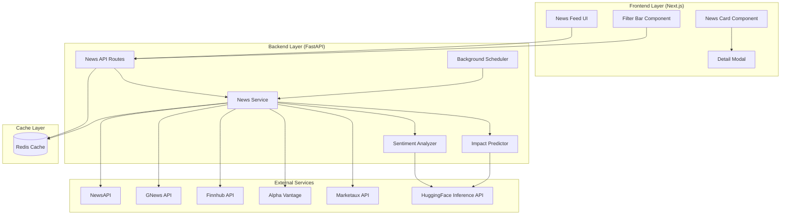
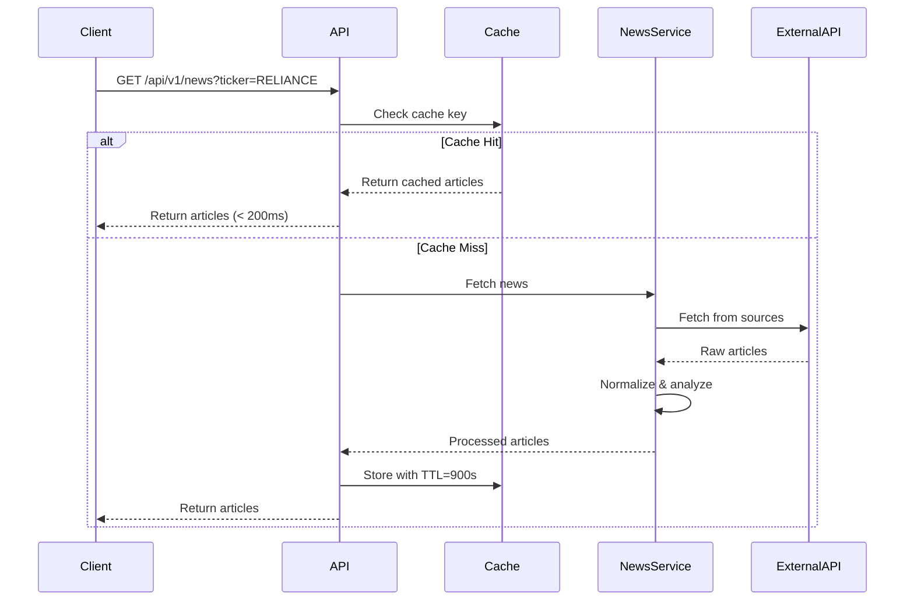
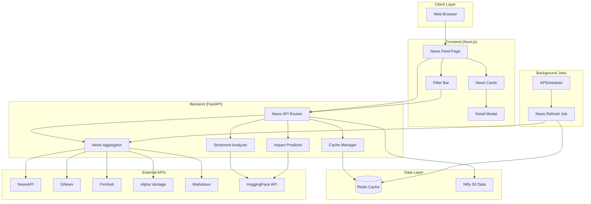
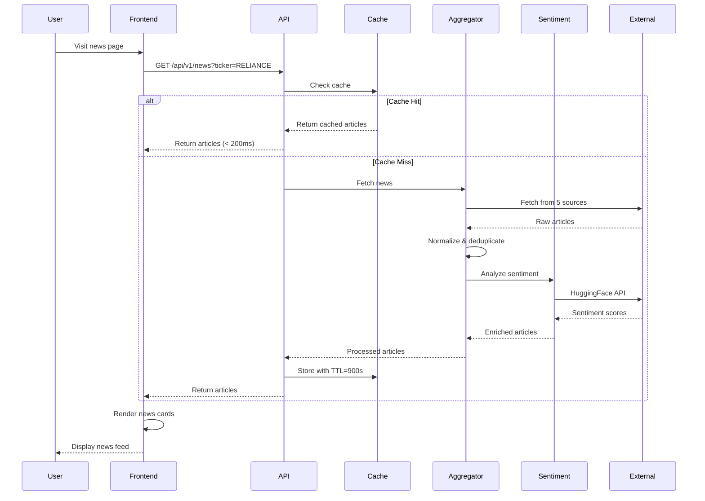
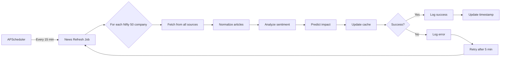

# Design Document: Market News Analysis Module

## Overview

The Market News Analysis Module extends the existing Finsight AI platform with real-time financial news aggregation, NLP-based sentiment analysis, and ML-based stock impact prediction. The system targets Indian large-cap companies (Nifty 50) and provides a Netflix-style news feed interface with advanced filtering capabilities.

### Key Design Goals

1. **Multi-Source Aggregation**: Fetch news from 5 free-tier APIs (NewsAPI, GNews, Finnhub, Alpha Vantage, Marketaux) with unified normalization
2. **AI-Powered Analysis**: Leverage HuggingFace Inference API with 3 pretrained BERT models for sentiment analysis
3. **Performance**: Sub-200ms response times for cached data through Redis caching layer
4. **Resilience**: Graceful degradation when external services are unavailable
5. **User Experience**: Responsive, accessible UI with real-time updates and advanced filtering

### Technology Stack

**Backend:**
- FastAPI (existing framework)
- Redis (caching layer with 15-minute TTL)
- APScheduler (background job scheduling)
- HuggingFace Inference API (sentiment analysis)
- httpx (async HTTP client)
- Pydantic (data validation)

**Frontend:**
- Next.js 14 (existing framework)
- React 18 with TypeScript
- Recharts (data visualization)
- date-fns (date formatting)
- Sonner (toast notifications)

## Architecture

### High-Level Architecture



### Component Architecture

#### Backend Components

**1. News Aggregator Service**
- **Responsibility**: Fetch and normalize news from multiple sources
- **Location**: `backend/app/services/news/aggregator.py`
- **Key Methods**:
  - `fetch_from_newsapi()`: Fetch from NewsAPI with India filter
  - `fetch_from_gnews()`: Fetch from GNews API
  - `fetch_from_finnhub()`: Fetch from Finnhub API
  - `fetch_from_alpha_vantage()`: Fetch from Alpha Vantage
  - `fetch_from_marketaux()`: Fetch from Marketaux API
  - `normalize_article()`: Convert raw API response to unified schema
  - `deduplicate_articles()`: Remove duplicate articles by URL and title similarity
  - `aggregate_all_sources()`: Orchestrate fetching from all sources

**2. Sentiment Analyzer Service**
- **Responsibility**: Analyze article sentiment using HuggingFace models
- **Location**: `backend/app/services/news/sentiment.py`
- **Key Methods**:
  - `analyze_sentiment()`: Process single article with BERT models
  - `batch_analyze()`: Process multiple articles in batch
  - `ensemble_prediction()`: Combine predictions from 3 models
  - `track_usage()`: Monitor HuggingFace API character usage

**3. Impact Predictor Service**
- **Responsibility**: Predict stock price impact from news sentiment
- **Location**: `backend/app/services/news/impact.py`
- **Key Methods**:
  - `predict_impact()`: Generate impact prediction with confidence
  - `apply_sector_weighting()`: Adjust prediction based on sector
  - `classify_magnitude()`: Determine impact magnitude (high/medium/low)

**4. Cache Manager**
- **Responsibility**: Manage Redis caching with TTL and invalidation
- **Location**: `backend/app/services/news/cache.py`
- **Key Methods**:
  - `get_cached_news()`: Retrieve cached articles with filter key
  - `set_cached_news()`: Store articles with 15-minute TTL
  - `invalidate_cache()`: Clear cache for specific ticker/sector
  - `generate_cache_key()`: Create cache key from filter parameters

**5. Background Scheduler**
- **Responsibility**: Execute periodic news refresh jobs
- **Location**: `backend/app/tasks/news_refresh.py`
- **Key Methods**:
  - `refresh_nifty50_news()`: Fetch news for all Nifty 50 companies
  - `handle_job_failure()`: Retry logic for failed jobs
  - `update_refresh_timestamp()`: Track last successful refresh

**6. Rate Limit Manager**
- **Responsibility**: Track and enforce external API rate limits
- **Location**: `backend/app/services/news/rate_limiter.py`
- **Key Methods**:
  - `check_rate_limit()`: Verify if API call is allowed
  - `increment_counter()`: Track API call count
  - `reset_counters()`: Hourly counter reset
  - `prioritize_sources()`: Select sources when rate limited

#### Frontend Components

**1. News Feed Page**
- **Responsibility**: Main page container with auto-refresh
- **Location**: `frontend/app/news/page.tsx`
- **State Management**:
  - `articles`: Array of NewsArticle objects
  - `filters`: Active filter state
  - `loading`: Loading state
  - `error`: Error state
- **Key Features**:
  - Auto-refresh every 15 minutes
  - URL query parameter sync
  - Skeleton loaders
  - Empty state handling

**2. Filter Bar Component**
- **Responsibility**: Multi-criteria filtering interface
- **Location**: `frontend/components/news/FilterBar.tsx`
- **Props**:
  - `onFilterChange`: Callback for filter updates
  - `activeFilters`: Current filter state
- **Features**:
  - Ticker autocomplete with Nifty 50 data
  - Multi-select sector dropdown
  - News type chip selector
  - Time range toggle buttons
  - Sentiment filter
  - Active filter count badge

**3. News Card Component**
- **Responsibility**: Display individual article in card format
- **Location**: `frontend/components/news/NewsCard.tsx`
- **Props**:
  - `article`: NewsArticle object
  - `onCardClick`: Callback for card interaction
- **Features**:
  - Responsive thumbnail (80x56px)
  - Sentiment badge with color coding
  - Impact prediction badge
  - Ticker chips
  - Relative timestamp
  - Hover effects with external link icon

**4. Article Detail Modal**
- **Responsibility**: Show detailed article analysis
- **Location**: `frontend/components/news/ArticleDetailModal.tsx`
- **Props**:
  - `article`: NewsArticle object
  - `isOpen`: Modal visibility state
  - `onClose`: Close callback
- **Features**:
  - Sentiment gauge chart (Recharts)
  - Stock price sparkline (7-day)
  - Related articles list
  - Keyboard navigation (Escape to close)
  - Focus trap

## Components and Interfaces

### Backend API Endpoints

#### 1. POST /api/v1/news/fetch
**Purpose**: Trigger manual news fetch and cache update

**Request Body**:
```typescript
{
  tickers?: string[];  // Optional: specific tickers to fetch
  force?: boolean;     // Optional: bypass cache
}
```

**Response**:
```typescript
{
  success: boolean;
  articles_fetched: number;
  sources_used: string[];
  cache_updated: boolean;
  timestamp: string;
}
```

**Error Responses**:
- 429: Rate limit exceeded
- 500: External API failure

#### 2. GET /api/v1/news
**Purpose**: Retrieve paginated and filtered news articles

**Query Parameters**:
```typescript
{
  page?: number;           // Default: 1
  limit?: number;          // Default: 20, Max: 50
  ticker?: string;         // Filter by ticker
  sector?: string;         // Filter by sector
  newsType?: string;       // earnings|merger|regulatory|market_analysis|general
  timeRange?: string;      // 1h|6h|24h|7d|30d
  sentiment?: string;      // positive|negative|neutral|all
}
```

**Response**:
```typescript
{
  articles: NewsArticle[];
  total: number;
  page: number;
  limit: number;
  has_more: boolean;
}
```

#### 3. GET /api/v1/news/:id
**Purpose**: Retrieve single article with full analysis

**Response**: `NewsArticle` object with extended fields

#### 4. POST /api/v1/news/analyze
**Purpose**: Run sentiment and impact analysis on custom article

**Request Body**:
```typescript
{
  title: string;
  description: string;
  ticker?: string;
  sector?: string;
}
```

**Response**:
```typescript
{
  sentiment: SentimentLabel;
  sentiment_score: number;
  confidence: number;
  impact_prediction: ImpactPrediction;
}
```

#### 5. GET /api/v1/tickers/nifty50
**Purpose**: Retrieve Nifty 50 company list with sectors

**Response**:
```typescript
{
  companies: Array<{
    ticker: string;
    name: string;
    sector: string;
    exchange: "NSE";
  }>;
  last_updated: string;
}
```

#### 6. GET /api/v1/news/trending
**Purpose**: Get top 5 most-impactful stories from last 24 hours

**Response**:
```typescript
{
  trending: NewsArticle[];
  computed_at: string;
}
```

### Data Models

#### NewsArticle Schema
```python
class NewsArticle(BaseModel):
    id: str                          # UUID
    ticker: Optional[str]            # NSE ticker or null for market-wide
    title: str                       # Article headline
    description: str                 # Article summary/description
    url: str                         # Source URL
    source: str                      # Source name (NewsAPI, Finnhub, etc.)
    published_at: datetime           # Publication timestamp
    image_url: Optional[str]         # Thumbnail URL
    related_tickers: List[str]       # Additional related tickers
    category: NewsCategory           # earnings|merger|regulatory|etc.
    sentiment: SentimentLabel        # positive|negative|neutral
    sentiment_score: float           # -1.0 to 1.0
    sentiment_confidence: float      # 0.0 to 1.0
    impact_prediction: Optional[ImpactPrediction]
    created_at: datetime             # Cache timestamp
```

#### ImpactPrediction Schema
```python
class ImpactPrediction(BaseModel):
    predicted_impact: ImpactLabel    # bullish|bearish|neutral
    confidence: float                # 0.0 to 1.0
    magnitude: MagnitudeLabel        # high|medium|low
    sector_weight: float             # Sector-specific adjustment
    reasoning: str                   # Human-readable explanation
```

#### Nifty50Company Schema
```python
class Nifty50Company(BaseModel):
    ticker: str                      # NSE ticker (e.g., "RELIANCE")
    name: str                        # Company name
    sector: str                      # Sector classification
    exchange: str                    # Always "NSE"
    market_cap: Optional[float]      # Market capitalization
```

#### CacheKey Structure
```python
# Format: news:{filter_type}:{param1}:{param2}:...
# Examples:
# - news:market:all:20
# - news:ticker:RELIANCE:10
# - news:sector:IT:24h:20
# - news:trending:24h
```

### External API Integration Patterns

#### NewsAPI Integration
```python
async def fetch_from_newsapi(
    query: str,
    from_date: str,
    to_date: str
) -> List[Dict]:
    """
    Fetch from NewsAPI with India filter
    Rate Limit: 100 requests/day (free tier)
    """
    url = "https://newsapi.org/v2/everything"
    params = {
        "q": f"{query} India",
        "from": from_date,
        "to": to_date,
        "language": "en",
        "sortBy": "publishedAt",
        "apiKey": settings.NEWS_API_KEY
    }
    # Implementation details...
```

#### HuggingFace Inference API Integration
```python
async def analyze_with_huggingface(
    text: str,
    model: str
) -> Dict:
    """
    Call HuggingFace Inference API
    Rate Limit: 30,000 characters/month (free tier)
    Models:
    - ProsusAI/finbert
    - yiyanghkust/finbert-tone
    - mrm8488/distilroberta-finetuned-financial-news-sentiment-analysis
    """
    url = f"https://api-inference.huggingface.co/models/{model}"
    headers = {"Authorization": f"Bearer {settings.HUGGINGFACE_API_KEY}"}
    payload = {"inputs": text[:512]}  # Truncate to 512 tokens
    # Implementation details...
```

### Redis Cache Flow



### Background Job Scheduling

```python
from apscheduler.schedulers.asyncio import AsyncIOScheduler
from apscheduler.triggers.interval import IntervalTrigger

scheduler = AsyncIOScheduler()

# Refresh Nifty 50 news every 15 minutes
scheduler.add_job(
    func=refresh_nifty50_news,
    trigger=IntervalTrigger(minutes=15),
    id="nifty50_news_refresh",
    replace_existing=True,
    max_instances=1
)

# Retry failed jobs after 5 minutes
scheduler.add_job(
    func=retry_failed_jobs,
    trigger=IntervalTrigger(minutes=5),
    id="retry_failed_jobs",
    replace_existing=True
)
```


## Correctness Properties

*A property is a characteristic or behavior that should hold true across all valid executions of a system—essentially, a formal statement about what the system should do. Properties serve as the bridge between human-readable specifications and machine-verifiable correctness guarantees.*

This feature involves external API integrations, UI rendering, and data transformation logic. Property-based testing is appropriate for the pure data transformation and normalization functions, but NOT for external API calls or UI components. The following properties focus on testable transformation logic.


### Property Reflection

After analyzing all acceptance criteria, I identified the following properties suitable for property-based testing:

**Data Transformation Properties:**
1. Query construction (1.2) - India filter appending
2. Article normalization (1.3) - Schema transformation
3. Article deduplication (1.5) - Duplicate removal
4. Article validation (1.6) - Required field validation
5. Article round-trip (20.6) - Serialization/deserialization

**Cache Management Properties:**
6. Cache key generation (2.3) - Consistent key creation

**Sentiment Analysis Properties:**
7. Text truncation (4.2) - 512 token limit
8. Sentiment output validation (4.3) - Label and score ranges
9. Character usage tracking (4.6) - Accurate counting
10. Sentiment round-trip (4.7) - Serialization/deserialization

**Impact Prediction Properties:**
11. Input validation (5.2) - Accept valid inputs
12. Output validation (5.3) - Correct structure and ranges
13. Confidence threshold (5.4) - Low confidence → neutral
14. Sector weighting (5.5) - Apply sector factors

**API Properties:**
15. Trending calculation (6.6) - Top 5 selection
16. Error response structure (16.3) - Consistent error format
17. Validation error structure (17.3) - Field-level errors

**Data Validation Properties:**
18. Pydantic validation (17.1) - Catch invalid inputs
19. Schema validation (17.2) - Validate before caching
20. Sentiment score range (17.4) - 0.0 to 1.0
21. Ticker validation (17.5) - Nifty 50 membership

**Other Properties:**
22. Company sorting (11.4) - Alphabetical order
23. API call tracking (12.1) - Accurate counts
24. Source prioritization (12.5) - Priority ordering
25. API key validation (14.3) - Format checking
26. Pagination limit (15.2) - Max 50 per page

**Redundancy Analysis:**

- **Properties 1.6 and 17.2 are redundant**: Both test article schema validation. Property 17.2 (schema validation before caching) subsumes 1.6 (required field validation). **Keep 17.2, remove 1.6.**

- **Properties 4.3 and 17.4 overlap**: Both test sentiment score range validation. Property 4.3 tests the full output structure including score range, while 17.4 only tests score range. **Keep 4.3 (more comprehensive), remove 17.4.**

- **Properties 5 and 9 are both round-trip properties**: Property 5 tests article normalization round-trip, while property 9 tests sentiment object round-trip. These are distinct data types and should both be kept.

- **Properties 16 and 17 both test error response structure**: Property 16 tests general error responses, while 17 tests validation-specific error responses. These can be combined into a single property that tests all error response structures. **Combine into single property.**

- **Properties 18 and 19 both test schema validation**: Property 18 tests Pydantic validation for API requests, while 19 tests schema validation before caching. These are different validation points and should both be kept.

**Final Property List (after removing redundancy):**

1. Query construction with India filter (1.2)
2. Article normalization to unified schema (1.3)
3. Article deduplication (1.5)
4. Cache key generation consistency (2.3)
5. Text truncation to 512 tokens (4.2)
6. Sentiment output structure and ranges (4.3)
7. Character usage tracking accuracy (4.6)
8. Sentiment serialization round-trip (4.7)
9. Impact prediction input validation (5.2)
10. Impact prediction output structure (5.3)
11. Low confidence classification (5.4)
12. Sector weighting application (5.5)
13. Trending articles selection (6.6)
14. Error response structure consistency (16.3 + 17.3 combined)
15. Request parameter validation (17.1)
16. Article schema validation (17.2)
17. Ticker validation against Nifty 50 (17.5)
18. Company list alphabetical sorting (11.4)
19. API call count tracking (12.1)
20. Source prioritization when rate limited (12.5)
21. API key format validation (14.3)
22. Pagination page size limit (15.2)
23. Article normalization round-trip (20.6)

### Property 1: Query Construction with India Filter

*For any* company name or ticker string, when constructing a search query for Indian companies, the query string SHALL contain either "India" or the NSE ticker suffix.

**Validates: Requirements 1.2**

### Property 2: Article Normalization Completeness

*For any* valid external API response, when normalized to the unified schema, the resulting article SHALL contain all required fields: id, title, description, url, source, published_at, and all optional fields SHALL be properly typed.

**Validates: Requirements 1.3**

### Property 3: Article Deduplication Correctness

*For any* set of articles containing duplicates (same URL or similar titles), the deduplication function SHALL return a set where no two articles share the same URL and no two titles have similarity score above 0.9.

**Validates: Requirements 1.5**

### Property 4: Cache Key Generation Consistency

*For any* combination of filter parameters (ticker, sector, timeRange, sentiment), generating a cache key twice with the same parameters SHALL produce identical keys, and different parameter combinations SHALL produce different keys.

**Validates: Requirements 2.3**

### Property 5: Text Truncation to Token Limit

*For any* article text (title + description), when preparing for sentiment analysis, the processed text SHALL contain at most 512 tokens.

**Validates: Requirements 4.2**

### Property 6: Sentiment Output Structure Validation

*For any* sentiment analysis result, the output SHALL contain a valid sentiment label (positive, negative, or neutral) and a confidence score in the range [0.0, 1.0].

**Validates: Requirements 4.3**

### Property 7: Character Usage Tracking Accuracy

*For any* sequence of sentiment analysis API calls, the tracked character count SHALL equal the sum of character lengths of all processed texts.

**Validates: Requirements 4.6**

### Property 8: Sentiment Serialization Round-Trip

*For any* valid sentiment analysis result object, serializing to JSON then deserializing SHALL produce an equivalent object with the same label and score.

**Validates: Requirements 4.7**

### Property 9: Impact Prediction Input Acceptance

*For any* valid combination of sentiment_label, sentiment_score, ticker, sector, and news_type, the impact predictor SHALL accept the input without raising a validation error.

**Validates: Requirements 5.2**

### Property 10: Impact Prediction Output Structure

*For any* valid impact prediction result, the output SHALL contain predicted_impact (bullish, bearish, or neutral), confidence in range [0.0, 1.0], and magnitude (high, medium, or low).

**Validates: Requirements 5.3**

### Property 11: Low Confidence Classification

*For any* impact prediction with confidence score below 0.5, the predicted_impact SHALL be classified as neutral regardless of other input factors.

**Validates: Requirements 5.4**

### Property 12: Sector Weighting Application

*For any* impact prediction, when a sector-specific weighting factor exists, the final confidence score SHALL reflect the application of that weighting factor.

**Validates: Requirements 5.5**

### Property 13: Trending Articles Selection

*For any* set of articles from the last 24 hours, the trending endpoint SHALL return the top 5 articles with the highest impact scores, sorted in descending order by impact score.

**Validates: Requirements 6.6**

### Property 14: Error Response Structure Consistency

*For any* error condition (validation error, server error, or external API failure), the error response SHALL contain error_code, message, and timestamp fields with appropriate types.

**Validates: Requirements 16.3, 17.3**

### Property 15: Request Parameter Validation

*For any* API request with invalid parameters (wrong type, out of range, or missing required fields), Pydantic validation SHALL reject the request before processing.

**Validates: Requirements 17.1**

### Property 16: Article Schema Validation Before Caching

*For any* article object, before storing in cache, schema validation SHALL verify all required fields are present and properly typed, rejecting invalid articles.

**Validates: Requirements 17.2**

### Property 17: Ticker Validation Against Nifty 50

*For any* ticker string, the validation function SHALL return true if and only if the ticker exists in the Nifty 50 company list (case-insensitive comparison).

**Validates: Requirements 17.5**

### Property 18: Company List Alphabetical Sorting

*For any* set of Nifty 50 companies, the returned list SHALL be sorted in ascending alphabetical order by ticker symbol.

**Validates: Requirements 11.4**

### Property 19: API Call Count Tracking Accuracy

*For any* sequence of external API calls to a specific source, the tracked call count SHALL equal the actual number of calls made to that source within the current hour.

**Validates: Requirements 12.1**

### Property 20: Source Prioritization When Rate Limited

*For any* set of news sources with assigned priority levels, when rate limited, the selected sources SHALL be ordered by priority (highest first) up to the available quota.

**Validates: Requirements 12.5**

### Property 21: API Key Format Validation

*For any* API key string, the validation function SHALL verify the key matches the expected format pattern for its respective service (NewsAPI, GNews, Finnhub, HuggingFace).

**Validates: Requirements 14.3**

### Property 22: Pagination Page Size Limit

*For any* paginated news request, regardless of the requested limit parameter, the returned page SHALL contain at most 50 articles.

**Validates: Requirements 15.2**

### Property 23: Article Normalization Round-Trip

*For any* normalized article object, serializing to the storage format then deserializing and normalizing again SHALL produce an equivalent article object with the same field values.

**Validates: Requirements 20.6**


## Error Handling

### Error Categories

#### 1. External API Errors

**Scenario**: External news API (NewsAPI, GNews, Finnhub, etc.) returns error or times out

**Handling Strategy**:
- Log error with source, endpoint, status code, and error message
- Continue processing remaining sources (fail gracefully)
- Return partial results from successful sources
- Cache partial results with shorter TTL (5 minutes)
- Track failed sources for monitoring

**Example**:
```python
try:
    response = await client.get(api_url, params=params, timeout=10)
    response.raise_for_status()
except httpx.TimeoutException:
    logger.warning(f"Timeout fetching from {source}: {api_url}")
    # Continue with other sources
except httpx.HTTPStatusError as e:
    logger.error(f"HTTP error from {source}: {e.response.status_code}")
    # Continue with other sources
```

#### 2. HuggingFace API Errors

**Scenario**: Sentiment analysis or impact prediction API fails

**Handling Strategy**:
- Return neutral sentiment with score 0.0 as fallback
- Log failure with article ID and error details
- Set `sentiment_confidence` to 0.0 to indicate fallback
- Display "Analysis Pending" badge in UI
- Retry failed analyses in background job after 5 minutes

**Example**:
```python
try:
    sentiment = await huggingface_client.analyze(text)
except Exception as e:
    logger.error(f"Sentiment analysis failed for article {article_id}: {e}")
    sentiment = SentimentResult(
        label=SentimentLabel.NEUTRAL,
        score=0.0,
        confidence=0.0
    )
```

#### 3. Cache Errors

**Scenario**: Redis connection fails or cache operation errors

**Handling Strategy**:
- Log cache error with operation type and key
- Bypass cache and fetch from source directly
- Return data to user without caching
- Alert monitoring system for Redis health check
- Retry cache connection with exponential backoff

**Example**:
```python
try:
    cached_data = await redis.get(cache_key)
except redis.RedisError as e:
    logger.error(f"Cache read error for key {cache_key}: {e}")
    cached_data = None  # Proceed without cache
```

#### 4. Validation Errors

**Scenario**: Invalid request parameters or malformed data

**Handling Strategy**:
- Return 422 Unprocessable Entity with field-level errors
- Use Pydantic validation error messages
- Include error code, field name, and descriptive message
- Log validation errors for monitoring

**Example Response**:
```json
{
  "error_code": "VALIDATION_ERROR",
  "message": "Invalid request parameters",
  "timestamp": "2024-01-15T10:30:00Z",
  "details": [
    {
      "field": "limit",
      "error": "value must be less than or equal to 50"
    }
  ]
}
```

#### 5. Rate Limit Errors

**Scenario**: External API rate limit exceeded

**Handling Strategy**:
- Track API call counts per source per hour
- When approaching 90% of quota, reduce fetch frequency
- When limit exceeded, skip that source and log warning
- Return cached data if available
- Display rate limit warning in UI if all sources exhausted

**Example**:
```python
if await rate_limiter.is_limited(source):
    logger.warning(f"Rate limit exceeded for {source}, skipping")
    continue  # Skip to next source
```

#### 6. Background Job Errors

**Scenario**: Scheduled news refresh job fails

**Handling Strategy**:
- Log job failure with full stack trace
- Retry after 5 minutes (max 3 retries)
- Send alert if all retries fail
- Continue with next scheduled execution
- Track job success/failure metrics

**Example**:
```python
@scheduler.scheduled_job('interval', minutes=15)
async def refresh_news():
    try:
        await news_service.fetch_all_sources()
        logger.info("News refresh completed successfully")
    except Exception as e:
        logger.error(f"News refresh failed: {e}", exc_info=True)
        # Retry logic handled by scheduler
```

### Error Response Format

All API errors follow a consistent structure:

```typescript
{
  error_code: string;      // Machine-readable error code
  message: string;         // Human-readable error message
  timestamp: string;       // ISO 8601 timestamp
  details?: object;        // Optional additional context
  request_id?: string;     // Optional request tracking ID
}
```

### Logging Strategy

**Log Levels**:
- **ERROR**: External API failures, unhandled exceptions, critical errors
- **WARNING**: Rate limit warnings, cache misses, degraded service
- **INFO**: Successful operations, job completions, cache hits
- **DEBUG**: Detailed request/response data (development only)

**Log Format**:
```python
logger.error(
    "External API error",
    extra={
        "source": "NewsAPI",
        "endpoint": "/v2/everything",
        "status_code": 429,
        "error_message": "Rate limit exceeded",
        "request_params": {"q": "RELIANCE India"},
        "timestamp": datetime.now(timezone.utc).isoformat()
    }
)
```

### Monitoring and Alerts

**Key Metrics to Monitor**:
- External API success/failure rates per source
- Average response times for cached vs uncached requests
- Cache hit/miss ratios
- Sentiment analysis success rate
- Background job success rate
- Rate limit utilization per source

**Alert Conditions**:
- External API failure rate > 50% for any source
- Cache unavailable for > 5 minutes
- Background job fails 3 consecutive times
- Rate limit exceeded on multiple sources simultaneously
- Average response time > 2 seconds for cached data

## Testing Strategy

### Overview

The testing strategy employs a dual approach combining property-based testing for data transformation logic with example-based testing for integration points, UI components, and infrastructure behavior.

### Property-Based Testing

**Framework**: `hypothesis` (Python) for backend, `fast-check` (TypeScript) for frontend

**Configuration**:
- Minimum 100 iterations per property test
- Each test tagged with feature name and property number
- Tag format: `# Feature: market-news-analysis-module, Property {N}: {description}`

**Test Organization**:
```
backend/tests/property/
├── test_article_normalization.py    # Properties 1-3, 23
├── test_cache_keys.py                # Property 4
├── test_sentiment_analysis.py        # Properties 5-8
├── test_impact_prediction.py         # Properties 9-12
├── test_api_responses.py             # Properties 13-15
├── test_validation.py                # Properties 16-17
└── test_rate_limiting.py             # Properties 19-21
```

**Example Property Test**:
```python
from hypothesis import given, strategies as st
import pytest

# Feature: market-news-analysis-module, Property 3: Article Deduplication
@given(st.lists(st.builds(NewsArticle)))
def test_deduplication_removes_duplicates(articles):
    """For any set of articles with duplicates, deduplication returns unique set"""
    # Add some duplicates
    duplicated = articles + articles[:len(articles)//2]
    
    result = deduplicate_articles(duplicated)
    
    # Check no duplicate URLs
    urls = [a.url for a in result]
    assert len(urls) == len(set(urls))
    
    # Check no similar titles (similarity > 0.9)
    for i, a1 in enumerate(result):
        for a2 in result[i+1:]:
            similarity = calculate_similarity(a1.title, a2.title)
            assert similarity <= 0.9
```

### Integration Testing

**Framework**: `pytest` with `httpx` async client

**Test Coverage**:
- External API integration (1 test per source with 3 examples)
- Redis cache operations (hit, miss, expiration)
- HuggingFace API integration (1 test per model)
- Background job execution
- API endpoint responses

**Example Integration Test**:
```python
@pytest.mark.asyncio
async def test_newsapi_integration():
    """Integration test for NewsAPI with 3 representative examples"""
    test_cases = [
        {"query": "RELIANCE India", "expected_min_results": 1},
        {"query": "TCS India", "expected_min_results": 1},
        {"query": "INFY India", "expected_min_results": 1},
    ]
    
    for case in test_cases:
        articles = await fetch_from_newsapi(case["query"])
        assert len(articles) >= case["expected_min_results"]
        assert all(a.source == "NewsAPI" for a in articles)
```

### Unit Testing

**Framework**: `pytest` for backend, `Jest` + `React Testing Library` for frontend

**Test Coverage**:
- Sentiment analysis fallback logic
- Impact prediction classification
- Error handling and logging
- Rate limit tracking
- Cache key generation
- Data validation

**Example Unit Test**:
```python
def test_low_confidence_classification():
    """Test that low confidence predictions are classified as neutral"""
    prediction = ImpactPrediction(
        predicted_impact=ImpactLabel.BULLISH,
        confidence=0.3,  # Below 0.5 threshold
        magnitude=MagnitudeLabel.HIGH
    )
    
    result = classify_impact(prediction)
    assert result.predicted_impact == ImpactLabel.NEUTRAL
```

### Frontend Component Testing

**Framework**: `Jest` + `React Testing Library` + `@testing-library/user-event`

**Test Coverage**:
- Filter bar interactions (search, multi-select, chips, toggles)
- News card rendering with various data states
- Article detail modal (open, close, keyboard navigation)
- Loading states and skeleton loaders
- Empty states
- Error states and toast notifications

**Example Component Test**:
```typescript
import { render, screen, fireEvent } from '@testing-library/react';
import { FilterBar } from '@/components/news/FilterBar';

test('applies filters when Enter key is pressed', async () => {
  const onFilterChange = jest.fn();
  render(<FilterBar onFilterChange={onFilterChange} activeFilters={{}} />);
  
  const searchInput = screen.getByPlaceholderText(/filter by ticker/i);
  fireEvent.change(searchInput, { target: { value: 'RELIANCE' } });
  fireEvent.keyDown(searchInput, { key: 'Enter' });
  
  expect(onFilterChange).toHaveBeenCalledWith({ ticker: 'RELIANCE' });
});
```

### End-to-End Testing

**Framework**: `Playwright` (optional, for critical user flows)

**Test Coverage**:
- Complete news feed loading flow
- Filter application and URL sync
- Article card click and modal display
- Auto-refresh behavior

### Performance Testing

**Tools**: `pytest-benchmark` for backend, Lighthouse for frontend

**Test Coverage**:
- Cached response time < 200ms
- Uncached response time < 2s
- Frontend initial load time
- Virtual scrolling performance with 100+ articles

### Test Execution

**Local Development**:
```bash
# Backend property tests
pytest backend/tests/property/ -v --hypothesis-show-statistics

# Backend integration tests
pytest backend/tests/integration/ -v

# Backend unit tests
pytest backend/tests/unit/ -v

# Frontend tests
cd frontend && npm test
```

**CI/CD Pipeline**:
1. Run all unit tests (fast feedback)
2. Run property tests with 100 iterations
3. Run integration tests (with mocked external APIs)
4. Run E2E tests on staging environment
5. Generate coverage report (target: 80% coverage)

### Test Data Management

**Fixtures**:
- Sample Nifty 50 company list
- Mock API responses from each source
- Sample articles with various sentiment scores
- Mock HuggingFace API responses

**Generators** (for property tests):
```python
from hypothesis import strategies as st

# Generate valid NewsArticle objects
article_strategy = st.builds(
    NewsArticle,
    id=st.uuids().map(str),
    ticker=st.one_of(st.none(), st.sampled_from(NIFTY_50_TICKERS)),
    title=st.text(min_size=10, max_size=200),
    description=st.text(min_size=50, max_size=1000),
    url=st.from_regex(r'https://[a-z]+\.com/[a-z0-9-]+', fullmatch=True),
    source=st.sampled_from(['NewsAPI', 'Finnhub', 'GNews']),
    published_at=st.datetimes(),
    sentiment=st.sampled_from(list(SentimentLabel)),
    sentiment_score=st.floats(min_value=-1.0, max_value=1.0),
    category=st.sampled_from(list(NewsCategory)),
)
```

### Mocking Strategy

**External APIs**:
- Use `respx` for mocking httpx requests in tests
- Create realistic mock responses based on actual API documentation
- Test both success and failure scenarios

**Redis**:
- Use `fakeredis` for unit tests
- Use real Redis instance for integration tests (Docker container)

**HuggingFace API**:
- Mock responses with realistic sentiment scores
- Test fallback behavior when API is unavailable

### Coverage Goals

- **Overall**: 80% code coverage
- **Critical paths**: 95% coverage (normalization, validation, error handling)
- **Property tests**: 100% of identified properties implemented
- **Integration tests**: All external API sources covered
- **UI components**: All interactive components tested


## Implementation Details

### Backend Implementation

#### File Structure

```
backend/app/
├── services/news/
│   ├── __init__.py
│   ├── aggregator.py          # Multi-source news fetching
│   ├── sentiment.py            # HuggingFace sentiment analysis
│   ├── impact.py               # Stock impact prediction
│   ├── cache.py                # Redis cache management
│   └── rate_limiter.py         # API rate limit tracking
├── tasks/
│   └── news_refresh.py         # APScheduler background jobs
├── api/routes/
│   └── news.py                 # News API endpoints (extend existing)
├── schemas/
│   └── news.py                 # Pydantic models (extend existing)
└── data/
    └── nifty50.json            # Static Nifty 50 company data
```

#### News Aggregator Implementation

```python
# backend/app/services/news/aggregator.py
from typing import List, Dict, Optional
import httpx
import asyncio
from datetime import datetime, timedelta
from app.schemas.news import NewsArticle, NewsCategory, SentimentLabel
from app.core.config import settings
from loguru import logger

class NewsAggregator:
    """Fetch and normalize news from multiple sources"""
    
    def __init__(self):
        self.sources = {
            'newsapi': self._fetch_newsapi,
            'gnews': self._fetch_gnews,
            'finnhub': self._fetch_finnhub,
            'alpha_vantage': self._fetch_alpha_vantage,
            'marketaux': self._fetch_marketaux,
        }
    
    async def aggregate_all_sources(
        self,
        query: str,
        limit: int = 20
    ) -> List[NewsArticle]:
        """Fetch from all sources and combine results"""
        tasks = [
            fetch_func(query, limit)
            for fetch_func in self.sources.values()
        ]
        
        results = await asyncio.gather(*tasks, return_exceptions=True)
        
        articles = []
        for i, result in enumerate(results):
            source_name = list(self.sources.keys())[i]
            if isinstance(result, Exception):
                logger.error(f"Error fetching from {source_name}: {result}")
                continue
            articles.extend(result)
        
        # Deduplicate and normalize
        articles = self.deduplicate_articles(articles)
        return articles[:limit]
    
    async def _fetch_newsapi(self, query: str, limit: int) -> List[NewsArticle]:
        """Fetch from NewsAPI with India filter"""
        if not settings.NEWS_API_KEY:
            return []
        
        url = "https://newsapi.org/v2/everything"
        params = {
            "q": f"{query} India",
            "from": (datetime.now() - timedelta(days=7)).isoformat(),
            "language": "en",
            "sortBy": "publishedAt",
            "pageSize": limit,
            "apiKey": settings.NEWS_API_KEY
        }
        
        async with httpx.AsyncClient(timeout=10) as client:
            try:
                response = await client.get(url, params=params)
                response.raise_for_status()
                data = response.json()
                
                return [
                    self._normalize_newsapi_article(article)
                    for article in data.get("articles", [])
                    if article.get("title") != "[Removed]"
                ]
            except Exception as e:
                logger.error(f"NewsAPI error: {e}")
                return []
    
    def _normalize_newsapi_article(self, raw: Dict) -> NewsArticle:
        """Convert NewsAPI response to unified schema"""
        return NewsArticle(
            id=str(uuid.uuid4()),
            ticker=None,  # Will be enriched later
            title=raw.get("title", ""),
            description=raw.get("description", ""),
            url=raw.get("url", ""),
            source=raw.get("source", {}).get("name", "NewsAPI"),
            published_at=datetime.fromisoformat(
                raw["publishedAt"].replace("Z", "+00:00")
            ),
            image_url=raw.get("urlToImage"),
            related_tickers=[],
            category=NewsCategory.GENERAL,
            sentiment=SentimentLabel.NEUTRAL,
            sentiment_score=0.0,
            sentiment_confidence=0.0,
            impact_prediction=None,
            created_at=datetime.now(timezone.utc)
        )
    
    def deduplicate_articles(self, articles: List[NewsArticle]) -> List[NewsArticle]:
        """Remove duplicate articles by URL and title similarity"""
        seen_urls = set()
        unique = []
        
        for article in articles:
            if article.url in seen_urls:
                continue
            
            # Check title similarity with existing articles
            is_duplicate = False
            for existing in unique:
                similarity = self._calculate_similarity(
                    article.title,
                    existing.title
                )
                if similarity > 0.9:
                    is_duplicate = True
                    break
            
            if not is_duplicate:
                seen_urls.add(article.url)
                unique.append(article)
        
        return unique
    
    def _calculate_similarity(self, text1: str, text2: str) -> float:
        """Calculate Jaccard similarity between two strings"""
        words1 = set(text1.lower().split())
        words2 = set(text2.lower().split())
        
        if not words1 or not words2:
            return 0.0
        
        intersection = words1.intersection(words2)
        union = words1.union(words2)
        
        return len(intersection) / len(union)
```

#### Sentiment Analyzer Implementation

```python
# backend/app/services/news/sentiment.py
from typing import Dict, List
import httpx
from app.schemas.news import SentimentLabel
from app.core.config import settings
from loguru import logger

class SentimentAnalyzer:
    """Analyze article sentiment using HuggingFace models"""
    
    MODELS = [
        "ProsusAI/finbert",
        "yiyanghkust/finbert-tone",
        "mrm8488/distilroberta-finetuned-financial-news-sentiment-analysis"
    ]
    
    def __init__(self):
        self.api_url = "https://api-inference.huggingface.co/models"
        self.headers = {
            "Authorization": f"Bearer {settings.HUGGINGFACE_API_KEY}"
        }
        self.character_usage = 0
        self.monthly_limit = 30000
    
    async def analyze_sentiment(
        self,
        title: str,
        description: str
    ) -> Dict:
        """Analyze sentiment using ensemble of BERT models"""
        # Truncate to 512 tokens
        text = self._truncate_text(f"{title}. {description}", max_tokens=512)
        
        # Check character limit
        if self.character_usage + len(text) > self.monthly_limit:
            logger.warning("HuggingFace character limit approaching")
            return self._fallback_sentiment()
        
        try:
            # Get predictions from all models
            predictions = await self._ensemble_predict(text)
            
            # Track usage
            self.character_usage += len(text)
            
            # Combine predictions
            return self._combine_predictions(predictions)
            
        except Exception as e:
            logger.error(f"Sentiment analysis failed: {e}")
            return self._fallback_sentiment()
    
    async def _ensemble_predict(self, text: str) -> List[Dict]:
        """Get predictions from all models"""
        async with httpx.AsyncClient(timeout=30) as client:
            tasks = [
                client.post(
                    f"{self.api_url}/{model}",
                    headers=self.headers,
                    json={"inputs": text}
                )
                for model in self.MODELS
            ]
            
            responses = await asyncio.gather(*tasks, return_exceptions=True)
            
            predictions = []
            for response in responses:
                if isinstance(response, Exception):
                    continue
                try:
                    data = response.json()
                    if isinstance(data, list) and len(data) > 0:
                        predictions.append(data[0])
                except Exception:
                    continue
            
            return predictions
    
    def _combine_predictions(self, predictions: List[Dict]) -> Dict:
        """Combine predictions from multiple models using voting"""
        if not predictions:
            return self._fallback_sentiment()
        
        # Count votes for each label
        label_scores = {}
        for pred in predictions:
            for item in pred:
                label = self._normalize_label(item["label"])
                score = item["score"]
                
                if label not in label_scores:
                    label_scores[label] = []
                label_scores[label].append(score)
        
        # Get label with highest average score
        best_label = max(
            label_scores.keys(),
            key=lambda l: sum(label_scores[l]) / len(label_scores[l])
        )
        
        avg_score = sum(label_scores[best_label]) / len(label_scores[best_label])
        
        # Convert to -1 to 1 scale
        sentiment_score = self._convert_score(best_label, avg_score)
        
        return {
            "label": best_label,
            "score": sentiment_score,
            "confidence": avg_score
        }
    
    def _normalize_label(self, label: str) -> SentimentLabel:
        """Normalize different model label formats"""
        label_lower = label.lower()
        if "positive" in label_lower or "bullish" in label_lower:
            return SentimentLabel.POSITIVE
        elif "negative" in label_lower or "bearish" in label_lower:
            return SentimentLabel.NEGATIVE
        else:
            return SentimentLabel.NEUTRAL
    
    def _convert_score(self, label: SentimentLabel, confidence: float) -> float:
        """Convert confidence to -1 to 1 scale"""
        if label == SentimentLabel.POSITIVE:
            return confidence
        elif label == SentimentLabel.NEGATIVE:
            return -confidence
        else:
            return 0.0
    
    def _truncate_text(self, text: str, max_tokens: int = 512) -> str:
        """Truncate text to maximum token count"""
        # Rough approximation: 1 token ≈ 4 characters
        max_chars = max_tokens * 4
        return text[:max_chars]
    
    def _fallback_sentiment(self) -> Dict:
        """Return neutral sentiment as fallback"""
        return {
            "label": SentimentLabel.NEUTRAL,
            "score": 0.0,
            "confidence": 0.0
        }
```

#### Cache Manager Implementation

```python
# backend/app/services/news/cache.py
from typing import Optional, List, Dict, Any
import json
from datetime import timedelta
from app.core.redis import get_redis
from app.schemas.news import NewsArticle
from loguru import logger

class CacheManager:
    """Manage Redis caching for news data"""
    
    DEFAULT_TTL = 900  # 15 minutes
    
    async def get_cached_news(
        self,
        filters: Dict[str, Any]
    ) -> Optional[List[NewsArticle]]:
        """Retrieve cached articles with filter key"""
        cache_key = self.generate_cache_key(filters)
        
        try:
            redis = await get_redis()
            cached_data = await redis.get(cache_key)
            
            if cached_data:
                articles_data = json.loads(cached_data)
                return [NewsArticle(**a) for a in articles_data]
            
            return None
            
        except Exception as e:
            logger.error(f"Cache read error for key {cache_key}: {e}")
            return None
    
    async def set_cached_news(
        self,
        filters: Dict[str, Any],
        articles: List[NewsArticle],
        ttl: int = DEFAULT_TTL
    ) -> bool:
        """Store articles with TTL"""
        cache_key = self.generate_cache_key(filters)
        
        try:
            redis = await get_redis()
            articles_data = [a.model_dump() for a in articles]
            
            await redis.setex(
                cache_key,
                ttl,
                json.dumps(articles_data, default=str)
            )
            
            return True
            
        except Exception as e:
            logger.error(f"Cache write error for key {cache_key}: {e}")
            return False
    
    async def invalidate_cache(
        self,
        ticker: Optional[str] = None,
        sector: Optional[str] = None
    ) -> int:
        """Clear cache for specific ticker or sector"""
        try:
            redis = await get_redis()
            
            if ticker:
                pattern = f"news:*ticker:{ticker}*"
            elif sector:
                pattern = f"news:*sector:{sector}*"
            else:
                pattern = "news:*"
            
            keys = await redis.keys(pattern)
            if keys:
                return await redis.delete(*keys)
            
            return 0
            
        except Exception as e:
            logger.error(f"Cache invalidation error: {e}")
            return 0
    
    def generate_cache_key(self, filters: Dict[str, Any]) -> str:
        """Create consistent cache key from filter parameters"""
        parts = ["news"]
        
        # Add filter components in consistent order
        if filters.get("ticker"):
            parts.append(f"ticker:{filters['ticker']}")
        if filters.get("sector"):
            parts.append(f"sector:{filters['sector']}")
        if filters.get("newsType"):
            parts.append(f"type:{filters['newsType']}")
        if filters.get("timeRange"):
            parts.append(f"time:{filters['timeRange']}")
        if filters.get("sentiment"):
            parts.append(f"sentiment:{filters['sentiment']}")
        
        parts.append(f"limit:{filters.get('limit', 20)}")
        
        return ":".join(parts)
```

### Frontend Implementation

#### Component Structure

```
frontend/
├── app/news/
│   └── page.tsx                    # Main news feed page
├── components/news/
│   ├── FilterBar.tsx               # Multi-criteria filter component
│   ├── NewsCard.tsx                # Individual article card
│   ├── ArticleDetailModal.tsx     # Full article analysis modal
│   ├── NewsFeedGrid.tsx           # Responsive grid layout
│   └── EmptyState.tsx             # Empty state component
├── lib/api/
│   └── news.ts                     # News API client functions
└── hooks/
    ├── useNewsFilters.ts           # Filter state management
    └── useAutoRefresh.ts           # Auto-refresh logic
```

#### Filter Bar Component

```typescript
// frontend/components/news/FilterBar.tsx
'use client';

import { useState, useEffect } from 'react';
import { Search, X, ChevronDown } from 'lucide-react';
import { useDebounce } from '@/hooks/useDebounce';

interface FilterBarProps {
  onFilterChange: (filters: NewsFilters) => void;
  activeFilters: NewsFilters;
  nifty50Companies: Company[];
}

export function FilterBar({
  onFilterChange,
  activeFilters,
  nifty50Companies
}: FilterBarProps) {
  const [searchInput, setSearchInput] = useState('');
  const [selectedSectors, setSelectedSectors] = useState<string[]>([]);
  const [selectedNewsTypes, setSelectedNewsTypes] = useState<string[]>([]);
  const [timeRange, setTimeRange] = useState('24h');
  const [sentiment, setSentiment] = useState('all');
  
  const debouncedSearch = useDebounce(searchInput, 300);
  
  useEffect(() => {
    applyFilters();
  }, [debouncedSearch, selectedSectors, selectedNewsTypes, timeRange, sentiment]);
  
  const applyFilters = () => {
    onFilterChange({
      ticker: debouncedSearch.toUpperCase() || undefined,
      sectors: selectedSectors.length > 0 ? selectedSectors : undefined,
      newsTypes: selectedNewsTypes.length > 0 ? selectedNewsTypes : undefined,
      timeRange,
      sentiment: sentiment !== 'all' ? sentiment : undefined
    });
  };
  
  const clearFilters = () => {
    setSearchInput('');
    setSelectedSectors([]);
    setSelectedNewsTypes([]);
    setTimeRange('24h');
    setSentiment('all');
  };
  
  const activeFilterCount = [
    searchInput,
    ...selectedSectors,
    ...selectedNewsTypes,
    sentiment !== 'all' ? sentiment : null
  ].filter(Boolean).length;
  
  return (
    <div className="card-surface p-4 space-y-4">
      {/* Search Input */}
      <div className="relative">
        <Search className="absolute left-3 top-1/2 -translate-y-1/2 h-4 w-4 text-muted-foreground" />
        <input
          value={searchInput}
          onChange={(e) => setSearchInput(e.target.value)}
          onKeyDown={(e) => e.key === 'Enter' && applyFilters()}
          placeholder="Search by ticker (RELIANCE, INFY...)"
          className="input-field pl-9 pr-9"
          list="ticker-suggestions"
        />
        <datalist id="ticker-suggestions">
          {nifty50Companies.map(c => (
            <option key={c.ticker} value={c.ticker}>
              {c.name}
            </option>
          ))}
        </datalist>
        {searchInput && (
          <button
            onClick={() => setSearchInput('')}
            className="absolute right-3 top-1/2 -translate-y-1/2"
          >
            <X className="h-4 w-4" />
          </button>
        )}
      </div>
      
      {/* Filter Row */}
      <div className="flex flex-wrap gap-3">
        {/* Sector Multi-Select */}
        <SectorMultiSelect
          selected={selectedSectors}
          onChange={setSelectedSectors}
        />
        
        {/* News Type Chips */}
        <NewsTypeChips
          selected={selectedNewsTypes}
          onChange={setSelectedNewsTypes}
        />
        
        {/* Time Range Toggles */}
        <TimeRangeToggle
          selected={timeRange}
          onChange={setTimeRange}
        />
        
        {/* Sentiment Filter */}
        <SentimentFilter
          selected={sentiment}
          onChange={setSentiment}
        />
        
        {/* Clear Button */}
        {activeFilterCount > 0 && (
          <button
            onClick={clearFilters}
            className="btn-secondary px-4"
          >
            Clear ({activeFilterCount})
          </button>
        )}
      </div>
    </div>
  );
}
```

#### News Card Component

```typescript
// frontend/components/news/NewsCard.tsx
'use client';

import Image from 'next/image';
import { formatDistanceToNow } from 'date-fns';
import { TrendingUp, TrendingDown, Minus, ExternalLink } from 'lucide-react';
import type { NewsArticle } from '@/types/news';

interface NewsCardProps {
  article: NewsArticle;
  onCardClick?: (article: NewsArticle) => void;
}

const sentimentConfig = {
  positive: {
    icon: TrendingUp,
    color: '#22C55E',
    badge: 'badge-green',
    label: 'Positive'
  },
  negative: {
    icon: TrendingDown,
    color: '#EF4444',
    badge: 'badge-red',
    label: 'Negative'
  },
  neutral: {
    icon: Minus,
    color: '#f59e0b',
    badge: 'badge-amber',
    label: 'Neutral'
  }
};

export function NewsCard({ article, onCardClick }: NewsCardProps) {
  const config = sentimentConfig[article.sentiment];
  const SentimentIcon = config.icon;
  
  return (
    <a
      href={article.url}
      target="_blank"
      rel="noopener noreferrer"
      className="block card-surface p-4 group overflow-hidden hover:shadow-lg transition-shadow"
      style={{ borderLeft: `3px solid ${config.color}` }}
      onClick={(e) => {
        if (onCardClick) {
          e.preventDefault();
          onCardClick(article);
        }
      }}
    >
      <div className="flex items-start gap-3">
        {/* Thumbnail */}
        {article.image_url && (
          <div className="w-20 h-14 relative rounded-xl overflow-hidden flex-shrink-0 hidden sm:block">
            <Image
              src={article.image_url}
              alt={article.title}
              fill
              className="object-cover"
              sizes="80px"
            />
          </div>
        )}
        
        <div className="flex-1 min-w-0">
          {/* Meta Row */}
          <div className="flex flex-wrap items-center gap-1.5 mb-2">
            {article.ticker && (
              <span className="badge badge-primary">{article.ticker}</span>
            )}
            <span className="badge bg-muted text-muted-foreground capitalize">
              {article.category.replace('_', ' ')}
            </span>
            <div className={`badge ml-auto ${config.badge}`}>
              <SentimentIcon className="h-3 w-3" />
              {config.label}
              <span className="opacity-70">
                {article.sentiment_score > 0 ? '+' : ''}
                {article.sentiment_score.toFixed(2)}
              </span>
            </div>
          </div>
          
          {/* Title */}
          <h3 className="text-card-title leading-snug group-hover:text-primary transition-colors line-clamp-2 mb-1">
            {article.title}
          </h3>
          
          {/* Description */}
          {article.description && (
            <p className="text-label-xs text-muted-foreground line-clamp-2 mb-2">
              {article.description}
            </p>
          )}
          
          {/* Impact Prediction */}
          {article.impact_prediction && (
            <div className="mb-2">
              <span className={`badge ${
                article.impact_prediction.predicted_impact === 'bullish'
                  ? 'badge-green'
                  : article.impact_prediction.predicted_impact === 'bearish'
                  ? 'badge-red'
                  : 'badge-amber'
              }`}>
                Impact: {article.impact_prediction.predicted_impact}
                ({(article.impact_prediction.confidence * 100).toFixed(0)}%)
              </span>
            </div>
          )}
          
          {/* Footer */}
          <div className="flex items-center gap-2 text-label-xs text-muted-foreground">
            <span className="font-medium">{article.source}</span>
            <span>·</span>
            <span>
              {formatDistanceToNow(new Date(article.published_at), {
                addSuffix: true
              })}
            </span>
            <ExternalLink className="h-3 w-3 ml-auto opacity-0 group-hover:opacity-60 transition-opacity" />
          </div>
        </div>
      </div>
    </a>
  );
}
```

### Deployment Considerations

#### Environment Variables

```bash
# Backend (.env)
NEWS_API_KEY=your_newsapi_key
GNEWS_API_KEY=your_gnews_key
FINNHUB_API_KEY=your_finnhub_key
ALPHA_VANTAGE_API_KEY=your_alphavantage_key
MARKETAUX_API_KEY=your_marketaux_key
HUGGINGFACE_API_KEY=your_huggingface_key

# Redis
REDIS_URL=redis://localhost:6379/0

# Frontend (.env.local)
NEXT_PUBLIC_API_URL=http://localhost:8000
```

#### Docker Compose Updates

```yaml
# Add to existing docker-compose.yml
services:
  # ... existing services ...
  
  scheduler:
    build: ./backend
    command: python -m app.tasks.news_refresh
    environment:
      - REDIS_URL=redis://redis:6379/0
    depends_on:
      - redis
      - backend
    restart: unless-stopped
```

#### Monitoring Setup

```python
# backend/app/core/monitoring.py
from prometheus_client import Counter, Histogram, Gauge

# Metrics
news_fetch_total = Counter(
    'news_fetch_total',
    'Total news fetch requests',
    ['source', 'status']
)

news_fetch_duration = Histogram(
    'news_fetch_duration_seconds',
    'News fetch duration',
    ['source']
)

cache_hit_rate = Gauge(
    'cache_hit_rate',
    'Cache hit rate percentage'
)

sentiment_analysis_total = Counter(
    'sentiment_analysis_total',
    'Total sentiment analyses',
    ['status']
)
```

## Diagrams

### System Architecture Diagram



### Data Flow Diagram



### Background Job Flow



## Summary

This design document provides a comprehensive blueprint for implementing the Market News Analysis Module. The system leverages multiple free-tier APIs for news aggregation, HuggingFace models for sentiment analysis, and Redis caching for performance optimization. The frontend provides a responsive, accessible interface with advanced filtering capabilities.

Key design decisions:
- **Multi-source aggregation** ensures comprehensive coverage despite free-tier limitations
- **Property-based testing** validates data transformation logic with 100+ iterations
- **Graceful degradation** maintains functionality when external services fail
- **Redis caching** with 15-minute TTL reduces API calls and improves response times
- **Background scheduling** keeps data fresh without user intervention
- **Responsive UI** with Netflix-style cards provides excellent user experience

The implementation follows existing project patterns and integrates seamlessly with the current FastAPI backend and Next.js frontend architecture.
